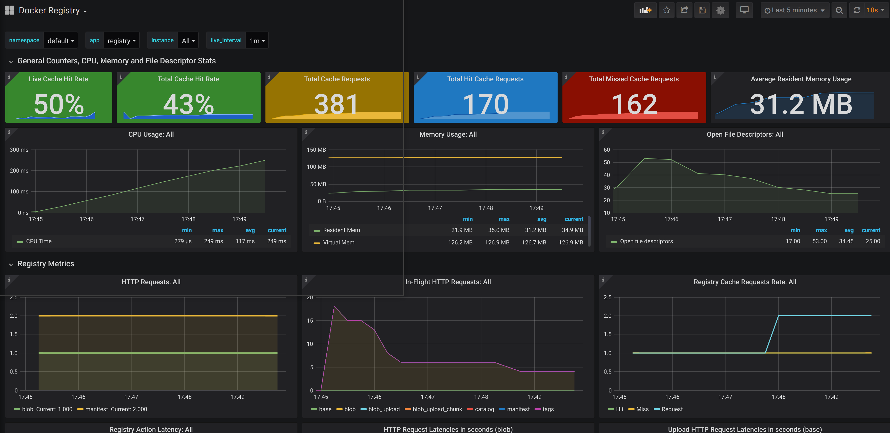

# local-docker-registry-proxy

Proxies Quay.io and Docker.io registries. All you need is to `mkcert "*.local"` and place the certificate
files in [the proper place](services/traefik/certs) according to the filenames dictated by [config.toml](services/traefik/traefik/dynamic/config.toml)

